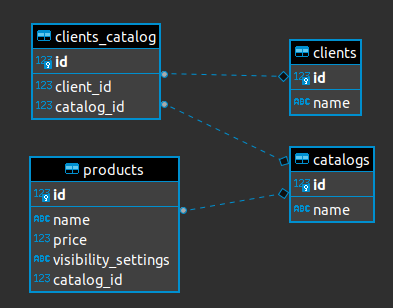

# Problem description
We have a system where products can be placed into catalogs and buyers are assigned to a
catalog. Products can have different visibility settings. If the setting is “default” then any buyer
can see the product. If the visibility is “catalog_members” then only buyers who are a member of
a catalog including the product can see it.

A query for products on behalf of a buyer should
return any product that has visibility “default” OR the product exists in a catalog that includes
the buyer. A product has a name, price, and visibility setting.

## How would you model these relationships?
**Answer:** I would have 4 tables as described bellow:
- catalogs
  - Catalog's related data table
- clients
  - Client's related data table
- clients_catalogs
  - A pivot table that handles the clients/catalog relation
- products
  - Product's related data table

The ER diagram could be seen in the [image](./er-diagram.png) bellow:



## How would you write a SQL query to return the list of products?

**Answer:** The following [query](./query.sql) can be used to achieve the solution of the described problem.

```
select * from products p
where
	(
		p.visibility_settings = 'default'
		or p.visibility_settings = 'catalog_members' and p.catalog_id in
		(
			select c.id	from catalogs c
			inner join clients_catalog cc on c.id = cc.catalog_id
			where cc.client_id = 2
		)
	)

```

> That's it! Thanks for the opportunity
